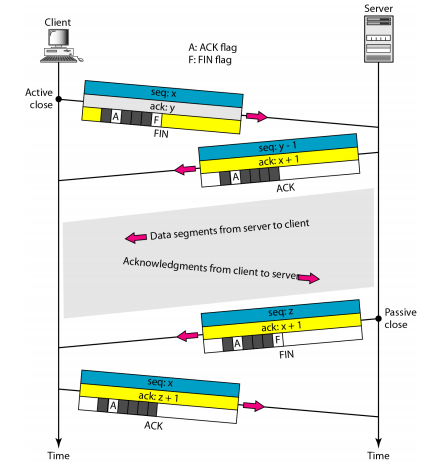

  <h1 style="text-align: center;font-weight: bold">Laporan Praktikum
   Workshop Administrasi Jaringan</h1>
  <h4 style="text-align: center;">Dosen Pengampu : Dr. Ferry Astika Saputra, S.T., M.Sc.</h4>

 

  
  <h3 style="text-align: center;">Disusun Oleh : </h3>
  

    <strong>Nama: Fauzan Abderrasheed</strong> 
    <strong>NRP: 3123500020 </strong> 
    <strong>Kelas: D3 IT A</strong>
  

<h3 style="text-align: center;line-height: 1.5">Politeknik Elektronika Negeri Surabaya Departemen Teknik Informatika Dan Komputer Program Studi Teknik Informatika 2023/2024</h3>
  

### 1. Analisa file http.cap dengan wireshark : Versi HTTP yang digunakan, IP address dari client maupun server, waktu dari client mengirimkan HTTP request., Waktu dari server mengirinmkan server dan berapa durasinya.

1. **Versi HTTP yang digunakan**
   - HTTP/1.1
2. **IP Address client dan server**
   - Client : 145.254.160.237
   - Server : 65.208.228.223
3. **Waktu dari client mengirimkan HTTP Request**
   - 0.911310

4. **Waktu dari server mengirimkan server dan berapa durasinya**
   - Waktu dari server mengirimkan server: 4.846969
   - Berapa durasinya: 4.846969 - 0.911310: 3.935659

### 2. Deskripsi gambar pada slide

1. **Node to Node: Data Link Layer**

   Data Link Layer bertanggung jawab atas komunikasi antar perangkat yang terhubung langsung dalam jaringan lokal atau melalui perantara seperti switch atau router. Lapisan ini bertanggung jawab untuk pengiriman frame data dari satu node ke node lain melalui link fisik, serta mendeteksi dan memperbaiki kesalahan transmisi.

2. **Host to Host: Network Layer**

   Lapisan Network bertanggung jawab untuk komunikasi antar host (komputer) dalam jaringan yang lebih luas. Fungsi utama dari lapisan ini adalah menentukan rute terbaik bagi data untuk mencapai tujuannya dari satu host ke host lain. Protokol utama yang digunakan adalah IP (Internet Protocol). Router dalam gambar bertindak sebagai perangkat jaringan yang menentukan jalur terbaik untuk mengirimkan paket data dari pengirim ke penerima.

3. **Process to Process: Transport Layer**

   Lapisan Transport bertanggung jawab untuk memastikan bahwa data dikirim dari satu proses aplikasi ke proses aplikasi lainnya di komputer tujuan dengan andal. Lapisan ini menangani fragmentasi data menjadi paket-paket kecil, mengontrol aliran data, serta menangani kesalahan pengiriman. Protokol utama dalam lapisan ini adalah TCP dan UDP. Dalam gambar, komunikasi proses-ke-proses berarti bahwa data yang dikirim oleh suatu aplikasi di satu komputer akan diterima oleh aplikasi yang sesuai di komputer tujuan.

### 3. Rangkuman tahapan komunikasi menggunakan TCP

TCP memiliki beberapa langkah utama untuk memastikan koneksi antara dua perangkat dalam jaringan. Berikut adalah tahapan komunikasi TCP:

1. Three-Way Handshake (Membangun Koneksi)

    

   Seperti namanya, terdapat 3 langkah untuk TCP membangun koneksi, berikut langkah-langkahnya:

   - SYN: Pengirim mengirimkan pesan SYN (synchronize) ke penerima untuk memulai koneksi.
   - SYN-ACK: Penerima merespons dengan SYN-ACK (synchronize-acknowledge) untuk mengonfirmasi permintaan koneksi.
   - ACK: Pengirim mengirimkan ACK terakhir untuk mengonfirmasi koneksi telah berhasil dibuat

2. Pengiriman Data (Data Transmission)

    

   Setelah koneksi terbentuk, data dikirim dalam bentuk segmen TCP dengan mekanisme berikut:

   - Data dipecah menjadi segmen yang diberi nomor urut (sequence number).
   - Setiap segmen dikirim ke penerima dan divalidasi menggunakan checksum untuk
     mendeteksi kesalahan.
   - Penerima mengirimkan ACK untuk mengonfirmasi segmen diterima dengan benar.
   - Jika segmen hilang atau rusak, pengirim akan mengirim ulang data (retransmission).

3. Four-Way Handshake (Terminasi Koneksi)

    

   Proses 4 langkah yang digunakan oleh TCP untuk mengakhiri koneksi:

   - FIN: Pengirim mengirimkan FIN (finish) ke penerima untuk mengakhiri transmisi data.
   - ACK: Penerima mengirimkan ACK untuk mengonfirmasi permintaan penghentian.
   - FIN: Penerima juga mengirimkan FIN untuk menutup koneksi dari sisi mereka.
   - ACK: Pengirim mengirimkan ACK terakhir untuk mengonfirmasi bahwa koneksi telah
     sepenuhnya ditutup.
