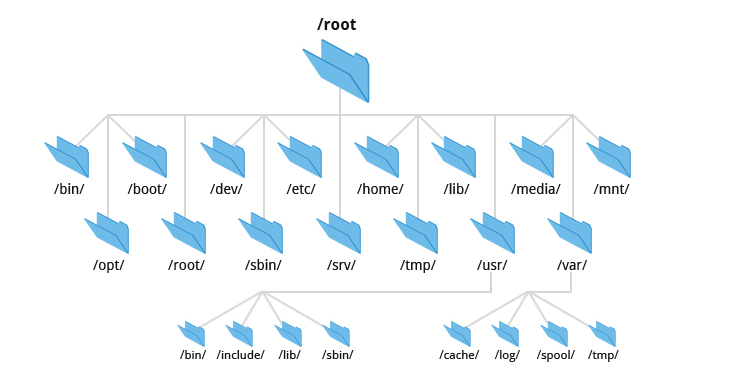
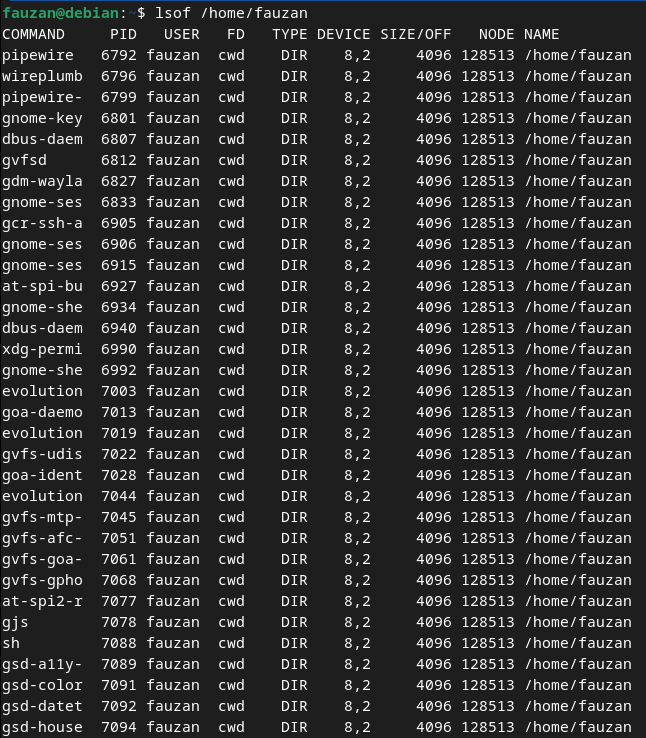
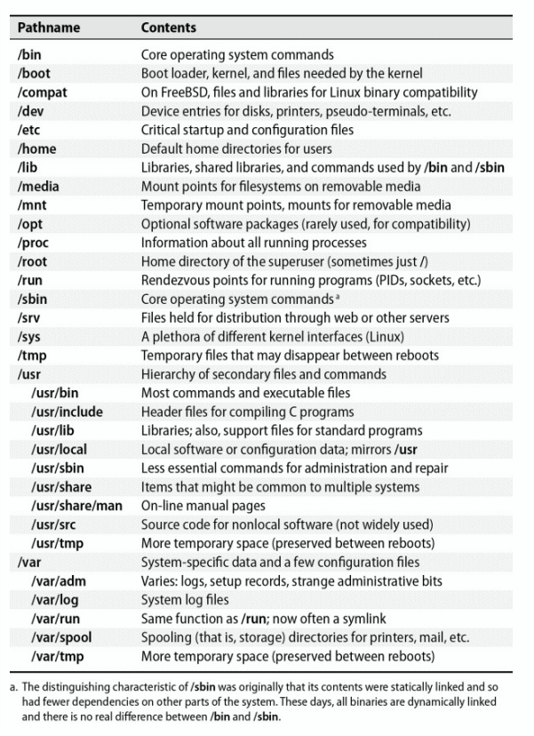
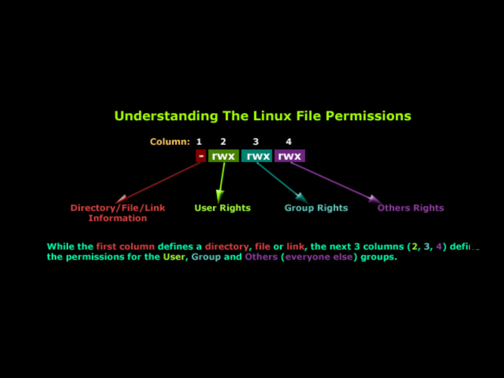

<div align="center">
  <h1 style="text-align: center;font-weight: bold">Laporan Praktikum
  <br>Workshop Administrasi Jaringan</h1>
  <h4 style="text-align: center;">Dosen Pengampu : Dr. Ferry Astika Saputra, S.T., M.Sc.</h4>
</div>
<br />
<div align="center">
  
  <h3 style="text-align: center;">Disusun Oleh : </h3>
  <p style="text-align: center;">
    <strong>Nama: Fauzan Abderrasheed</strong><br>
    <strong>NRP: 3123500020 </strong><br>
    <strong>Kelas: D3 IT A</strong>
  </p>
<h3 style="text-align: center;line-height: 1.5">Politeknik Elektronika Negeri Surabaya<br>Departemen Teknik Informatika Dan Komputer<br>Program Studi Teknik Informatika<br>2023/2024</h3>
  <hr><hr>
</div>

Chapter 5: **The Filesystem**



Tujuan dasar sistem berkas adalah untuk merepresentasikan dan mengatur sumber daya penyimpanan sistem.

Sistem berkas dapat dianggap sebagai sebuah sistem yang terdiri dari empat komponen utama:

- Namespace - cara untuk menamai sesuatu dan mengaturnya dalam sebuah hirarki
- API - seperangkat panggilan sistem untuk menavigasi dan memanipulasi objek
- Model keamanan - skema untuk melindungi, menyembunyikan, dan berbagi sesuatu
- Implementasi - perangkat lunak untuk menghubungkan model logis ke perangkat keras

Sistem berkas berbasis disk modern terus berkembang dengan meningkatkan kecepatan, keandalan, dan fitur tambahan di atas fungsi sistem berkas tradisional. Sistem berkas berbasis disk yang paling umum digunakan termasuk ext4, XFS, UFS, ZFS, dan Btrfs dari Oracle, juga masih banyak sistem berkas lain yang tersedia, termasuk VxFS dari Veritas dan JFS dari IBM. Selain itu, ada sistem berkas asing seperti FAT dan NTFS yang digunakan di Windows, serta ISO 9660 yang digunakan untuk CD dan DVD. Sebagian sistem berkas modern berusaha mengimplementasikan fungsionalitas sistem berkas tradisional dengan cara yang lebih cepat dan andal.

### **Pathnames**

Untuk menjaga ketepatan terminologi, sebaiknya menggunakan "direktori" daripada "folder" dalam konteks teknis. Dalam sistem berkas, pathname adalah daftar direktori yang mengarah ke berkas. pathname dapat absolut, yang menunjukkan lokasi lengkap berkas dalam hierarki (misalnya, /home/username/file.txt), atau relatif, yang bergantung pada lokasi kerja saat ini (misalnya, ./file.txt).

### **Filesystem Mounting and Unmounting**

Sistem berkas terdiri dari bagian-bagian lebih kecil yang masing-masing memiliki berkas, direktori, dan subdirektori, yang secara keseluruhan membentuk pohon berkas. Cabang-cabang dalam pohon berkas ini disebut sistem berkas, dan perintah "mount" digunakan untuk memasang sistem berkas pada pohon berkas. Perintah “mount” memetakan sebuah direktori dalam pohon berkas yang ada, yang disebut titik pemasangan (mount point), ke akar sistem berkas baru.

Contoh:

```bash
# Mount the filesystem on /dev/sda4 to /users
mount /dev/sda4 /users
```

Linux memiliki opsi lazy unmount (umount -l) yang menghapus sistem berkas dari hirarki penamaan, namun tidak benar-benar meng-unmount hingga sistem berkas tersebut tidak digunakan lagi.

umount -f adalah unmount paksa, yang berguna ketika sistem berkas sedang sibuk.

Daripada menggunakan umount -f, Anda dapat menggunakan lsof atau fuser untuk mengetahui proses mana yang menggunakan sistem berkas dan kemudian mematikannya.

Contoh:

```bash
# Find out which processes are using the filesystem
lsof /home/abdou
```



Untuk menyelidiki proses yang menggunakan sistem berkas, Anda dapat menggunakan perintah ps.

Contoh:

```bash
# Investigate the processes that are using the filesystem

ps up "1234 5678 91011"
```


### **Organization of the file tree**

Sistem UNIX memiliki struktur yang tidak teratur dan banyak konvensi penamaan yang tidak kompatibel, sehingga sulit untuk meningkatkan sistem operasi.

Sistem berkas root mencakup setidaknya direktori root dan seperangkat berkas serta subdirektori minimal. Kernel sistem operasi biasanya berada di bawah direktori "/boot", tetapi nama dan lokasinya dapat berbeda-beda tergantung pada sistem operasi yang digunakan. Kernel BSD dan beberapa versi UNIX terdiri dari berbagai komponen, bukan satu file.

/etc berisi file sistem dan konfigurasi yang krusial. /sbin dan /bin untuk utilitas penting, dan terkadang /tmp untuk file sementara. Secara tradisional /dev merupakan bagian dari sistem berkas root, tetapi sekarang ini /dev merupakan sistem berkas virtual yang di-mount secara terpisah.

Beberapa sistem menyimpan berkas pustaka bersama (shared library) dan berkas lainnya, seperti preprocessor C, di direktori "/lib" atau "/lib64", sementara sistem lain memindahkan berkas ke direktori "/usr/lib", dengan "/lib" sering kali digunakan sebagai link simbolik.

Direktori /usr dan /var memiliki peran yang sangat penting. Direktori /usr menyimpan sebagian besar program standar yang tidak kritis untuk operasi sistem, disertai berkas-berkas lain seperti manual online dan pustaka. Di FreeBSD, konfigurasi lokal umumnya ditempatkan di /usr/local. Sementara itu, direktori /var menyimpan direktori spool, berkas log, data akuntansi, serta berkas-berkas lain yang sering berubah atau tumbuh dengan cepat pada setiap host. Kedua direktori ini harus selalu tersedia agar sistem dapat berjalan hingga mencapai mode multiuser.



### **File types**

Sebagian besar implementasi sistem berkas mendefinisikan tujuh jenis berkas:

1. File biasa
2. Direktori
3. File perangkat karakter
4. Memblokir file perangkat
5. Soket domain lokal
6. Pipa bernama (FIFO)
7. Tautan simbolis

Anda dapat menentukan jenis file dengan menggunakan perintah file (ketik man file untuk informasi lebih lanjut).


Anda juga dapat menggunakan ls -ld, flag -d memaksa ls untuk menampilkan informasi untuk sebuah direktori dan bukan menampilkan isi direktori tersebut.


**`Regular files`** terdiri dari serangkaian byte; sistem berkas tidak menerapkan struktur pada isinya. File teks, file data, program yang dapat dieksekusi, dan pustaka bersama semuanya disimpan sebagai file biasa.

**`Direktori`** adalah nama referensi ke file lain.

**`Hard Links`** adalah cara untuk memberikan nama ganda pada satu file. Perintah ln membuat tautan keras baru ke file yang sudah ada. Opsi -i pada ls menyebabkannya menampilkan jumlah hard link ke setiap file.

Contoh:


**Character and block device files**

Program dapat berkomunikasi dengan perangkat keras dan periferal sistem melalui file perangkat. Untuk setiap perangkat sistem, kernel menyertakan atau memuat perangkat lunak driver, yang menangani detail yang kompleks dalam mengelola setiap perangkat. Akibatnya, kernel itu sendiri dapat tetap sederhana dan tidak bergantung pada perangkat keras.

Tidak perlu untuk membedakan perangkat karakter dari perangkat blok karena perbedaan mereka tidak jelas.

Nomor perangkat mayor dan minor digunakan untuk menandai file perangkat. Nomor mayor menunjukkan driver yang mengelola perangkat, sedangkan nomor minor biasanya menunjukkan driver unit fisik mana yang akan dituju. Sebagai contoh, pada sistem Linux, nomor perangkat mayor 4 menunjukkan driver serial. Memiliki nomor perangkat mayor 4 dan minor 1, port serial pertama (/dev/tty0) dan port serial kedua (/dev/tty1) akan memiliki nomor perangkat mayor 4 dan minor 1, dan seterusnya.

Di masa lalu, /dev adalah direktori umum, dan perangkat dibuat dengan mknod dan dihapus dengan rm. Sayangnya, sistem yang masih mentah ini tidak siap untuk menangani banyak driver dan jenis perangkat yang muncul selama beberapa dekade terakhir. Selain itu, sistem ini memungkinkan semua jenis ketidaksesuaian konfigurasi yang mungkin terjadi, seperti berkas perangkat yang tidak menunjukkan perangkat yang sebenarnya, perangkat yang tidak dapat diakses karena kekurangan berkas perangkat, dan sebagainya.

Saat ini, kernel dan daemon pengguna secara otomatis mengelola direktori **/dev** melalui sistem berkas khusus. Soket domain lokal dan pipa bernama memungkinkan antarproses dalam satu host untuk berkomunikasi, seperti yang dilakukan oleh Syslog dan X Window System. Tautan simbolik, juga dikenal sebagai tautan lunak, memberikan fleksibilitas dalam menamai berkas dengan menunjuk lokasi berkas berdasarkan nama, bahkan lintas sistem berkas dan direktori. Untuk ilustrasi, **/usr/bin** sering kali berfungsi sebagai link simbolik ke /bin, yang membantu mengurangi ukuran sistem berkas root dan mendukung pembagian perangkat lunak antarhost.

```bash
$ ln -s /bin /usr/bin

$ ls -l /usr/bin
lrwxrwxrwx 1 root root 4 Mar  1  2020 /usr/bin -> /bin
```


### **File attributes**

Dalam sistem berkas Unix dan Linux, setiap file memiliki mode akses dua belas bit. Ini terdiri dari sembilan bit hak akses (membaca, menulis, dan menjalankan) untuk pemilik, grup, dan individu lainnya, serta tiga bit khusus yang mempengaruhi eksekusi program. Selain itu, ada empat bit tipe file yang ditetapkan saat file dibuat dan tidak dapat diubah. Perintah "chmod" memungkinkan pemilik file dan superuser untuk mengubah mode akses 12 bit.



**Permission bits**

Dalam sistem berkas Unix dan Linux, bit izin dibagi menjadi tiga kelompok: pemilik (user/u), grup (group/g), dan lainnya (others/o). Setiap kelompok memiliki tiga bit izin untuk membaca (read/r), menulis (write/w), dan mengeksekusi (execute/x). Kelompok ini dikenal sebagai "Hugo". Izin ini diwakili dengan oktal, dengan nilai 400, 200, dan 100 untuk pemilik, 40, 20, dan 10 untuk grup, dan 4, 2, dan 1 untuk lainnya. Bit baca memungkinkan file dibaca, bit tulis memungkinkan modifikasi tetapi penghapusan dikendalikan oleh izin direktori induk. Bit execute memungkinkan file dijalankan, baik sebagai biner langsung oleh CPU atau sebagai skrip yang diinterpretasikan oleh program seperti shell atau Python, yang ditentukan melalui baris shebang.

```bash
#!/usr/bin/perl
```

Dalam sistem operasi Unix, file non-biner yang tidak menentukan interpreter dianggap sebagai skrip shell (sh). Jika interpreter tidak ditentukan dengan benar melalui shebang ("#!"), kernel akan menolak file tersebut, dan shell akan mencoba menjalankannya sebagai skrip shell biasa. Untuk direktori, bit eksekusi (execute bit), juga dikenal sebagai bit cari atau scan, memungkinkan akses dan navigasi ke direktori, tetapi tidak melihat isi. Kombinasi bit baca dan eksekusi memungkinkan untuk membaca dan mendaftar isi direktori, sedangkan kombinasi bit ketik dan eksekusi memungkinkan untuk membuat, menghapus, atau mengubah nama file dalam direktori. Pengaturan bit eksekusi pada direktori dan file sangat penting.

### **The setuid and setgid bits**

Saat file dieksekusi, bit **setuid** (4000) dan **setgid** (2000) dapat mengubah pemilik atau grup file sementara. **Setuid** mengubah pemilik file menjadi pemilik file saat dieksekusi, dan **setgid** mengubah grup file menjadi grup file itu sendiri. Setgid pada direktori memudahkan berbagi file antar pengguna dalam grup yang sama dengan memastikan bahwa file baru yang dibuat di dalam direktori memiliki grup yang sama dengan grup direktori.

### **The sticky bit**

Bit lengket, yang memiliki nilai oktal 1000, ditetapkan pada direktori untuk mencegah pengguna menghapus atau mengganti nama file yang bukan miliknya. Ini berguna untuk direktori seperti /tmp, yang sering digunakan oleh banyak orang.

### **ls: list and inspect files**

Daftar file dan direktori dalam sebuah direktori dapat ditampilkan dengan perintah "ls". Perintah ini dapat menampilkan informasi yang lebih detail dalam format panjang dengan opsi "-l". Informasi ini termasuk beberapa atribut penting, seperti mode file (izin akses), jumlah hard link yang mengarah ke file, pemilik file, grup file, ukuran file dalam byte, waktu modifikasi terakhir, dan nama file.

Setidaknya ada dua koneksi keras untuk setiap direktori, yaitu satu untuk dirinya sendiri (entri `.`) dan satu lagi untuk direktori induknya (entri..`). Koneksi ini memungkinkan untuk bergerak antar direktori dalam struktur file.

Untuk file perangkat, keluaran "ls" agak berbeda. Misalnya, untuk file perangkat, informasi tentang tipe perangkat dan mayor/minor angka akan ditampilkan, yang menunjukkan bahwa file tersebut adalah perangkat daripada file biasa.


### **chmod: change permissions**

Perintah chmod mengubah mode dari sebuah file. Anda dapat menggunakan notasi oktal atau notasi simbolik.


Examples of chmod's mnemonic syntax:

| Specifier    | Meaning                                                             |
| ------------ | ------------------------------------------------------------------- |
| `u+w`        | Add write permission for the file's owner                           |
| `ug=rw,o=r`  | Gives r/w permission to owner and group, and r permission to others |
| `a-x`        | Remove execute permission for all users                             |
| `ug=srx, o=` | Set the setuid, setgid, and sticky bits for owner and group (r/x)   |
| `g=u`        | Make the group's permissions the same as the owner's                |

Tips: Anda juga dapat menentukan mode yang akan ditetapkan dengan menyalin mode dari file lain dengan opsi --reference. (contoh: chmod --reference = file sumber file target)

### **chown: change ownership**

Perintah chown mengubah pemilik dan grup sebuah berkas.
Opsi -R menyebabkan chown mengubah kepemilikan isi berkas secara rekursif.

```bash
$ chown -R abdou:users /home/abdou
```


### **chgrp: change group**

Perintah chgrp mengubah grup sebuah file.
Opsi -R menyebabkan chgrp mengubah grup isi file secara rekursif.

```bash
$ chgrp -R users /home/abdou
```


### **umask: set default permissions**

Perintah umask menetapkan izin default untuk file dan direktori baru. Perintah umask adalah sebuah bit mask yang dikurangkan dari izin default untuk menentukan izin yang sebenarnya.

contoh:

```bash
$ umask 022
```

| Octal | Binary | Perms |
| ----- | ------ | ----- |
| 0     | 000    | ---   |
| 1     | 001    | --x   |
| 2     | 010    | -w-   |
| 3     | 011    | -wx   |
| 4     | 100    | r--   |
| 5     | 101    | r-x   |
| 6     | 110    | rw-   |
| 7     | 111    | rwx   |


Sebagai contoh, umask 027 mengizinkan rwx untuk pemilik, rx untuk grup, dan tidak ada izin untuk orang lain.

### **Access Control Lists**

ACL memungkinkan banyak pemilik dan izin berbeda untuk sekelompok pengguna pada file yang berbeda, memperluas model perizinan Unix konvensional. Setiap aturan ACL disebut "Access Control Entry (ACE)." ACE terdiri dari grup atau pengguna, topeng izin, dan tipe (izin atau tolak). ACL file dapat dilihat dengan perintah "getfacl", dan dapat diatur dengan perintah "setfacl".

```bash
$ getfacl /etc/passwd
```


```bash
$ setfacl -m u:abdou:rw /etc/passwd
```


### Implementasi ACL

Secara teoritis, pemeliharaan dan penegakan ACL bisa menjadi tanggung jawab dari beberapa komponen dalam sistem. ACL dapat diterapkan oleh kernel untuk seluruh sistem berkas, oleh masing-masing sistem berkas itu sendiri, atau bahkan oleh perangkat lunak tingkat atas seperti server NFS dan SMB.

### POSIX ACLs

POSIX ACLs merupakan implementasi ACL tradisional pada sistem Unix. ACL jenis ini didukung oleh mayoritas sistem operasi yang mirip Unix, termasuk Linux, FreeBSD, dan Solaris.

**Format entri yang umum ditemui pada POSIX ACLs:**

| Format                | Contoh          | Menetapkan izin untuk         |
| --------------------- | --------------- | ----------------------------- |
| user::perms           | user:rw-        | Pemilik berkas                |
| user:username:perms   | user:abdou:rw-  | Pengguna dengan nama tertentu |
| group::perms          | group:r-x       | Grup berkas                   |
| group:groupname:perms | group:users:r-x | Grup dengan nama tertentu     |
| mask::perms           | mask::rwx       | Izin maksimum                 |
| other::perms          | other::r--      | Semua pengguna lainnya        |

Contoh penerapannya:

```bash
$ setfacl -m user:abdou:rwx,group:users:rwx,other::r /home/abdou

$ getfacl --omit-header /home/abdou

user::rwx
user:abdou:rwx
group::r-x
group:users:r-x
mask::rwx
other::r--

```

### NFSv4 ACLs

NFSv4 ACLs merupakan jenis ACL yang lebih baru dan memiliki kekuatan lebih. ACL ini didukung oleh beberapa sistem operasi mirip Unix, seperti Linux dan FreeBSD.

Meskipun NFSv4 ACLs mirip dengan POSIX ACLs, mereka menawarkan fitur tambahan, misalnya adanya **default ACL** yang secara otomatis mengatur ACL untuk berkas dan direktori baru.

**Izin berkas NFSv4**
