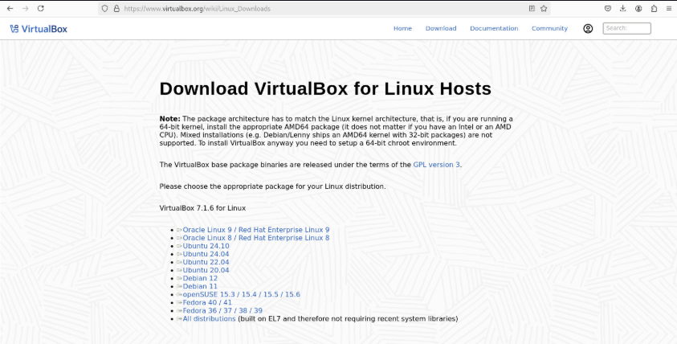
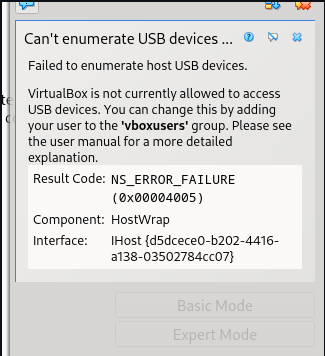
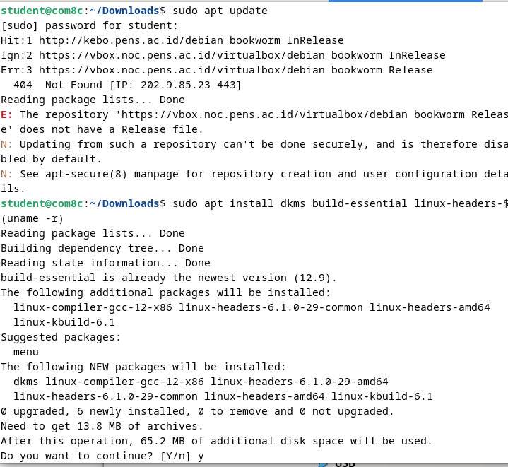
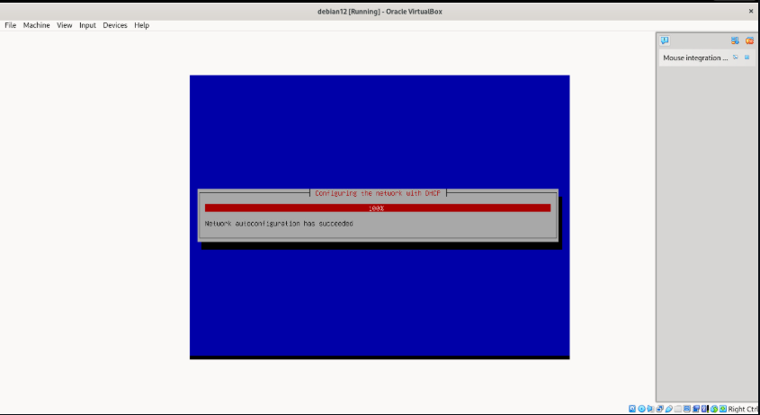

<div align="center">
  <h1 style="text-align: center;font-weight: bold">Laporan Praktikum
  <br>Workshop Administrasi Jaringan</h1>
  <h4 style="text-align: center;">Dosen Pengampu : Dr. Ferry Astika Saputra, S.T., M.Sc.</h4>
</div>
<br />
<div align="center">
  
  <h3 style="text-align: center;">Disusun Oleh : </h3>
  <p style="text-align: center;">
    <strong>Nama: Fauzan Abderrasheed</strong><br>
    <strong>NRP: 3123500020 </strong><br>
    <strong>Kelas: D3 IT A</strong>
  </p>
<h3 style="text-align: center;line-height: 1.5">Politeknik Elektronika Negeri Surabaya<br>Departemen Teknik Informatika Dan Komputer<br>Program Studi Teknik Informatika<br>2023/2024</h3>
  <hr><hr>
</div>

# Instalasi Debian dan Oracle Virtual Box

## Solve LAN Wired Not Connected


```
sudo dhclient -v
```

Perintah di atas digunakan untuk menginisialisasi kembali konfigurasi jaringan secara dinamis melalu DHCP dengan menampilkan output secara rinci

## IP Komputer Lab


Setelah berhasil connect dengan LAN maka komputer akan mendapatkan IP Address

## Clone Github

Install git di komputer lab


```
sudo apt install git
```

Gunakan command di atas untuk menginstall git di komputer lab

Lalu lakukan clone menggunakan git clone


```
git clone https://github.com/ferryastika/unix-and-linux-sysadmin-notes.git
```

## Cek OS


```
lsb_release -a
```

Gunakan command di atas untuk mengecek OS komputer yang digunakan

## Download VirtualBox



https://www.virtualbox.org/wiki/Linux_Downloads

Download menyesuaikan dengan OS yang digunakan komputer

## Download ISO Debian 12


https://www.debian.org/download

ISO yang akan digunakan di dalam VirtualBox

## Install VirtualBox


```
sudo dpkg -i virtualbox-7.1_7.1.6-167084~Debian~bookworm_amd64.deb
```

Gunakan command di atas untuk melakukan instalasi VirtualBox

## Solving Error VirtualBox

Setelah proses instalasi, akan muncul error seperti ini saat VirtualBox dibuka



Solve menggunakan perintah:

```
sudo usermod -a -G vboxusers $USERS
```

Perintah ini menambahkan pengguna yang sedang login ke dalam grup `vboxusers`, yang biasanya diperlukan agar bisa mengakses fitur tertentu di VirtualBox, seperti USB passthrough.

## New Virtual Machine

Membuat Virtual Machine baru, sesuaikan Name dan Operating System seperti gambar di bawah ini


Sesuaikan Unattended Install seperti gambar dibawah ini


Sesuaikan Hardware seperti gambar dibawah ini


Sesuaikan Hard Disk seperti gambar dibawah ini


## Kernel Error


Gunakan perintah ini untuk memperbaiki kernel error

```
sudo apt update
sudo apt install dkms build-essential linux-headers-$(uname -r)
sudo /sbin/vboxconfig
```



## Run Virtual Machine

Jalankan dan tunggu sampai debian pada VM sudah terinstall dan terinisialisasi dengan benar




Jika sudah seperti gambar di bawah, maka bisa dipastikan install debian 12 pada VirtualBox telah berhasil


Selanjutnya klik Next hingga done, jika sudah seperti gambar di bawah maka debian pada VirtualBox sudah siap digunakan

