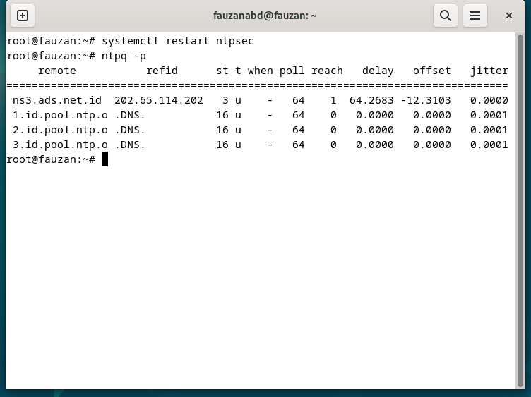
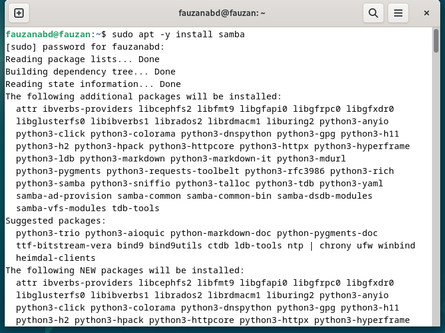
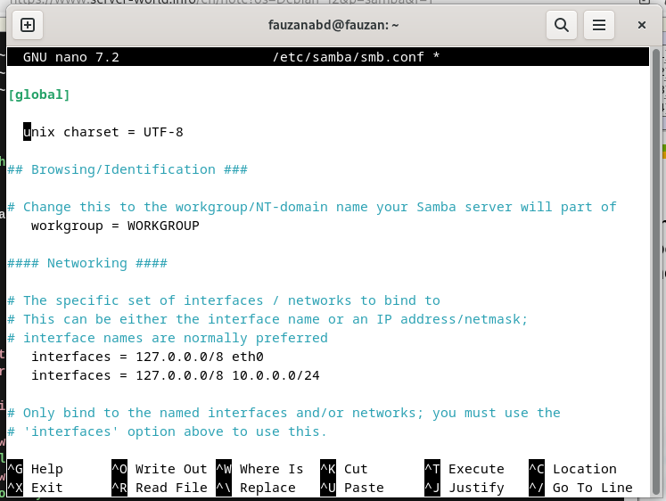
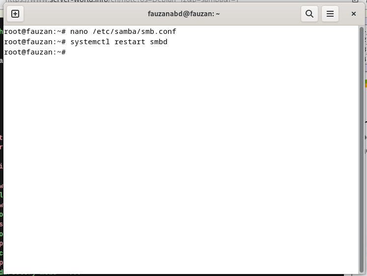
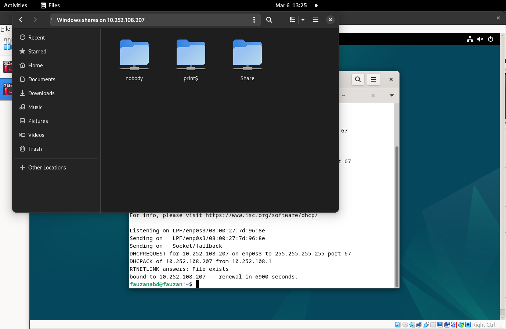

<div align="center">
  <h1 style="text-align: center;font-weight: bold">Laporan Praktikum
  <br>Workshop Administrasi Jaringan</h1>
  <h4 style="text-align: center;">Dosen Pengampu : Dr. Ferry Astika Saputra, S.T., M.Sc.</h4>
</div>
<br />
<div align="center">
  
  <h3 style="text-align: center;">Disusun Oleh : </h3>
  <p style="text-align: center;">
    <strong>Nama: Fauzan Abderrasheed</strong><br>
    <strong>NRP: 3123500020 </strong><br>
    <strong>Kelas: D3 IT A</strong>
  </p>
<h3 style="text-align: center;line-height: 1.5">Politeknik Elektronika Negeri Surabaya<br>Departemen Teknik Informatika Dan Komputer<br>Program Studi Teknik Informatika<br>2023/2024</h3>
  <hr><hr>
</div>

## A. Instalasi NTP Client

1. Install dan konfigurasi NTP Client

   

1. Cek date saat ini berdasarkan lokasi device:
1. Atur NTP Server

   Ubah konfigurasi NTP Server sesuai zona device, pada percobaan ini menggunakan kode zona id yaitu indonesia dari link https://www.ntppool.org/en/zone/id

   

   Lalu restart menggunakan command `systemctl restart ntpsec` dan verifikasi status seperti berikut:

   

   Jika kode ‘id’ sudah muncul, berarti sudah benar

## B. Instalasi dan Konfigurasi Samba

1.  Install samba

    

2.  Membuat public shared folder

    

3.  Lakukan konfigurasi pada /etc/samba/smb.conf

    1. tambahkan unix charset = UTF-8 dan interfaces 127.0.0.0/8 10.0.0.0/24

       

    2. Cek map to guest = bad user

       

    3. Konfigurasi shared directory

       

    4. Restart smbd menggunakan command `systemctl restart smbd`

       

    5. Akses melalui Windows

       

    6. Akses melalui Linux

       

4.  Membuat limited shared folder

    1.  Buat grup baru smbgroup01, buat direktori share01, ubah kepemilikan folder share01 menjadi smbgroup01, berikan izin penuh (read, write, execute) kepada pemilik dan grup. Izin 770 memastikan keamanan dengan membatasi akses ke anggota grup yang telah ditentukan:

        

    2.  Konfigurasi /etc/samba/smb.conf

        

    3.  Tambahkan share01 pada /etc/samba/smb.conf

        

    4.  tambahkan user baru 'debian'

        

        

    5.  Login pada Windows

        

    6.  Login dengan file manager linux dan cli

        

## C. Rangkuman tentang Manajemen Paket

### 1. Sumber-Sumber Perangkat Lunak

Debian GNU/Linux menggunakan repositori sebagai metode distribusi perangkat lunak. Pendekatan ini memungkinkan sentralisasi aplikasi dan memberikan antarmuka yang sederhana untuk mengelola serta memperbarui sistem, sehingga pengguna tidak perlu mengunjungi situs web masing-masing aplikasi secara langsung.

### 1.1 Berkas _sources.list_

Alamat repositori Debian disimpan dalam berkas _/etc/apt/sources.list_ dan juga pada berkas-berkas dengan tipe _/etc/apt/sources.list.d/xxx.list_. Untuk mengedit berkas ini, Anda dapat menggunakan perintah-perintah berikut (dalam mode administrator):

```bash
apt edit-sources
nano /etc/apt/sources.list

```

Beberapa elemen penting dalam berkas tersebut antara lain:

- **deb**: Menandakan repositori biner.
- **deb-src**: Menunjukkan repositori sumber.
- **http...** atau **https...**: Alamat server repositori.
- **bookworm** atau **bookworm-security**: Nama cabang repositori yang spesifik.
- **main**, **contrib**, **non-free**, **non-free-firmware**: Bagian atau komponen repositori.

Penting untuk diperhatikan, meskipun sistem ini didasarkan pada Debian Stable, nama versi spesifik seperti _bookworm_ digunakan untuk menunjukkan versi paket yang ada. Secara umum, _stable_ merupakan label generik yang menggambarkan rilis stabil saat ini. Saat Debian beralih ke versi baru (misalnya Debian 13 _Trixie_), _bookworm_ akan berubah status menjadi _oldstable_.

### 1.2 Cabang dan Komponen Repositori

Repositori resmi Debian terbagi menjadi empat bagian:

- **main**: Paket yang sepenuhnya mematuhi DFSG (Debian Free Software Guidelines) tanpa ketergantungan pada paket non-free.
- **contrib**: Paket yang mematuhi DFSG namun memiliki beberapa ketergantungan pada paket non-free.
- **non-free**: Paket yang tidak mematuhi DFSG.
- **non-free-firmware**: Firmware non-free yang disertakan secara default sejak Debian 12.

Hanya paket yang terdapat di bagian _main_ yang mendapatkan dukungan penuh dari Proyek Debian dan dianggap 100% perangkat lunak bebas. Paket dalam contrib, non-free, dan non-free-firmware sebagian atau seluruhnya non-free. Paket pada bagian lainnya, meskipun dapat berguna, tidak mendapatkan dukungan penuh dan bisa memerlukan driver proprietary untuk perangkat keras tertentu.

### 1.3 Paket Backport

Debian menyediakan repositori khusus yang disebut _backports_. Repositori ini berisi versi terbaru dari aplikasi yang ada pada repositori pengembangan, tetapi dikompilasi ulang agar kompatibel dengan rilis stabil. Meskipun _backports_ tidak diaktifkan secara default, mekanisme ini memungkinkan pengguna untuk mengakses pembaruan tanpa mengganggu stabilitas sistem, karena prioritas utama tetap diberikan kepada repositori standar.

### 1.4 Memodifikasi Repositori

Sebelum mengubah sumber perangkat lunak, pahami risiko penggunaan komponen _contrib_ atau _non-free_:

- **Kebebasan Terbatas:** Paket non-free tidak sepenuhnya bebas.
- **Dukungan Terbatas:** Proyek Debian hanya mendukung paket yang ada di bagian _main_.
- **Integritas Sistem:** Menambahkan paket non-free dapat mengubah komposisi sistem Debian yang 100% bebas.

Untuk mengubah sumber perangkat lunak, edit berkas `sources.list` dengan perintah:

```bash
apt edit-sources

```

Contoh baris untuk paket _free_ saja:

```bash
deb http://deb.debian.org/debian/ bookworm main

```

Contoh baris untuk paket _free_ dan _proprietary_:

```bash
deb http://deb.debian.org/debian/ bookworm main contrib non-free non-free-firmware

```

Anda juga dapat mengubah sumber perangkat lunak melalui Synaptic Package Manager menggunakan antarmuka grafis.

---

### 2. APT di Terminal

APT (Advanced Package Tool) adalah alat utama untuk mengelola paket di Debian melalui terminal. Selain APT, Debian juga mendukung _aptitude_, yang menawarkan fitur manajemen paket tambahan.

### 2.1 Perintah Informasi (User Mode)

Perintah berikut dapat dijalankan tanpa hak akses root karena hanya menampilkan informasi:

- `apt show foo` – Menampilkan informasi detail paket _foo_.
- `apt search foo` – Mencari paket yang mengandung kata _foo_.
- `apt-cache policy foo` – Menampilkan kebijakan versi untuk paket _foo_.

### 2.2 Perintah Pemeliharaan (Administrator Mode)

Perintah di bawah ini harus dijalankan dengan hak akses root (gunakan `su -` untuk masuk ke mode administrator):

- `apt update` – Memperbarui metadata dari repositori.
- `apt install foo` – Menginstal paket _foo_ beserta dependensinya.
- `apt upgrade` – Memperbarui semua paket yang telah terinstal.
- `apt full-upgrade` – Memperbarui paket dengan penambahan atau penghapusan paket lain jika diperlukan.
- `apt remove foo` – Menghapus paket _foo_ tanpa menghapus berkas konfigurasi.
- `apt purge foo` – Menghapus paket _foo_ beserta berkas konfigurasinya.
- `apt autoremove foo` – Menghapus paket yang tidak lagi diperlukan.
- `apt clean` – Menghapus cache paket yang tersimpan.
- `apt autoclean` – Menghapus cache paket yang usang.
- `apt-mark showmanual` – Menampilkan paket yang diinstal secara manual.

Untuk melakukan pembaruan sistem secara menyeluruh dan membersihkan cache, Anda dapat menjalankan:

```bash
apt update && apt full-upgrade && apt autoclean

```

Sedangkan untuk menghapus paket yang tidak berguna, beserta dependensi dan konfigurasi lama:

```bash
apt autoremove --purge

```

---

### 3. Software: Manajer Paket yang Disederhanakan

Software adalah antarmuka grafis yang memudahkan pengelolaan paket aplikasi di Debian. Dengan aplikasi ini, Anda dapat:

- **Mencari aplikasi:** Menggunakan tombol pencarian atau menjelajahi kategori.
- **Menginstal aplikasi:** Cukup pilih aplikasi yang diinginkan dan tekan tombol “Instal”. Proses instalasi dapat dipantau melalui jendela utama.
- **Menghapus aplikasi:** Buka kategori “Terinstal” dan pilih “Hapus” untuk menghapus aplikasi dengan konfirmasi.
- **Memperbarui aplikasi:** Daftar pembaruan dapat dilihat di bagian “Pembaruan”. Beberapa pembaruan, terutama yang menyangkut sistem operasi, mungkin memerlukan restart.
- **Mengubah repositori:** Melalui menu “Repositori”, Anda dapat mengatur sumber paket, misalnya menambahkan repositori _non-free_, sesuai dengan informasi dari berkas _sources.list_.
- **Pembaruan otomatis:** Aktifkan opsi pembaruan otomatis agar sistem tetap terbarui tanpa intervensi manual.

---

### 4. Discover: Manajer Paket KDE

Discover adalah manajer paket bawaan KDE yang intuitif dan efisien, menggabungkan fungsi pencarian, instalasi, penghapusan, dan pembaruan aplikasi dalam satu antarmuka.

### Fitur Utama:

- **Pencarian dan Instalasi:** Cari aplikasi melalui bidang pencarian atau kategori, kemudian instal dengan menekan tombol “Instal” (dengan konfirmasi kata sandi administrator).
- **Widget dan Addon Plasma:** Menyediakan opsi untuk menambahkan komponen tambahan ke lingkungan desktop Plasma.
- **Penghapusan Aplikasi:** Hapus aplikasi dengan mudah dari kategori “Terinstal”.
- **Pembaruan Aplikasi:** Proses pembaruan dikelola secara otomatis atau dapat dilakukan manual dengan memilih “Perbarui Semua”.
- **Pengelolaan Repositori:** Ubah sumber aplikasi melalui menu “Pengaturan” yang menampilkan alamat repositori sesuai berkas _sources.list_.

---

### 5. Synaptic: Manajer Paket Lengkap

Synaptic adalah alat pengelolaan paket dengan antarmuka grafis yang menampilkan semua paket, termasuk pustaka sistem. Sama seperti APT, Synaptic memerlukan hak akses administrator dan koneksi internet untuk menginstal atau memperbarui paket.

### Fitur Synaptic:

- **Antarmuka Terbagi:** Terdiri dari bilah alat, panel kiri (untuk pengurutan dan pemilihan), panel tengah (daftar paket), dan panel bawah (deskripsi paket).
- **Muat Ulang Informasi:** Pastikan untuk melakukan “Muat Ulang” saat pertama kali membuka Synaptic untuk memperbarui data paket.
- **Pengelolaan Repositori:** Ubah sumber paket melalui menu “Pengaturan > Repositori”, sesuai dengan isi berkas _/etc/apt/sources.list_.
- **Pembaruan Sistem:** Muat ulang informasi paket, tandai pembaruan, dan terapkan perubahan. Periksa ketergantungan tambahan jika diperlukan.
- **Penginstalan Ulang:** Gunakan opsi “Tandai untuk Penginstalan Ulang” untuk mengembalikan konfigurasi default suatu aplikasi.
- **Penghapusan Paket:** Tandai paket untuk penghapusan atau penghapusan lengkap (termasuk konfigurasi) dengan klik kanan.
- **Pembersihan Sisa Konfigurasi:** Hapus paket-paket yang tidak lagi diperlukan, termasuk sisa konfigurasi, dari kategori “Tidak Terinstal (konfigurasi residu)”.
- **Informasi Rinci:** Klik paket untuk melihat detail seperti ketergantungan, ukuran, dan versi. Gunakan opsi “Properti” untuk informasi lengkap.
- **Preferensi:** Sesuaikan tampilan dan perilaku Synaptic, seperti pengaturan kolom, font, warna status, manajemen cache, konfigurasi jaringan, dan kebijakan pembaruan.

---

### 6. Membersihkan Sistem

Meski kapasitas hard disk semakin besar, menjaga ruang kosong tetap penting. Berikut beberapa langkah untuk membersihkan sistem:

### 6.1 Mengecek Ruang Disk

- **Terminal:** Gunakan perintah `df` untuk melihat ringkasan penggunaan ruang pada setiap partisi.
- **Pengurutan Direktori:** Gabungan perintah `du` dan `sort` dapat menampilkan direktori berdasarkan ukuran.
- **NCDU:** Alat berbasis terminal yang efektif untuk analisis ruang disk.
- **Baobab:** Alat analisis ruang disk grafis yang terintegrasi dengan lingkungan Gnome dan tersedia untuk desktop lainnya.

### 6.2 Membersihkan Paket

- **Cache Paket:** Hapus cache paket yang tersimpan di `/var/cache/apt/archives/` menggunakan perintah APT.
- **Paket Tak Terpakai:** Hapus paket yang tidak lagi dibutuhkan, termasuk file konfigurasi.
- **Deaborphan:** Gunakan alat seperti deborphan untuk mengidentifikasi paket yang sudah tidak diperlukan.

### 6.3 Mengosongkan Tempat Sampah

Periksa tiga lokasi utama:

- **Pengguna:** `~/local/share/Trash/`
- **Administrator:** `/root/local/share/Trash/`
- **Eksternal:** Misalnya, `/media/your_id/your_disk/Trash_1000`

Tempat sampah dapat dikosongkan melalui manajer berkas atau perintah terminal.

### 6.4 Membersihkan Cache Aplikasi

Beberapa aplikasi menyimpan cache untuk mempercepat akses. Jika folder cache membesar, hapus isinya. Contohnya, Firefox memungkinkan pengaturan pembersihan cache secara otomatis saat aplikasi ditutup.

### 6.5 Membersihkan Thumbnail

Thumbnail yang dihasilkan saat membuka folder gambar atau video dapat menumpuk. Hapus folder thumbnail untuk membebaskan ruang; folder ini akan dibuat ulang secara otomatis saat dibutuhkan.

---

### 7. Menginstal Paket Eksternal ".deb"

Meskipun Debian mengutamakan repositori paket, Anda mungkin perlu menginstal paket eksternal berformat ".deb".

### 7.1 Instalasi dengan GDebi (Mode Grafis)

GDebi adalah utilitas grafis yang mengelola pemasangan paket ".deb" beserta dependensinya. Instal GDebi melalui manajer paket atau terminal, lalu buka file ".deb" untuk memulai pemasangan. Untuk menghapus paket, gunakan opsi “Remove Package”.

### 7.2 Instalasi dengan Dpkg (Mode Terminal)

Dpkg mengelola paket tanpa menangani dependensi secara otomatis. Jika terjadi kesalahan karena ketergantungan, instal paket yang diperlukan dengan APT, kemudian ulangi pemasangan menggunakan Dpkg. Untuk penghapusan, gunakan perintah Dpkg yang sesuai.

---

### 8. Menginstal Aplikasi Flatpak

Flatpak adalah sistem aplikasi virtualisasi yang menyediakan lingkungan sandbox terisolasi, sehingga aplikasi dijalankan secara independen dari sistem utama.

### Keunggulan Flatpak:

- **Keamanan:** Aplikasi berjalan dalam sandbox yang meminimalkan risiko penyebaran perangkat lunak berbahaya.
- **Fleksibilitas:** Memungkinkan pemasangan dan penggunaan beberapa versi aplikasi secara bersamaan.

### Kelemahan Flatpak:

- **Verifikasi:** Flatpak tidak diverifikasi oleh sistem keamanan Debian, sehingga disarankan untuk mengunduh aplikasi dari sumber terpercaya seperti Gimp, VLC, atau Blender.

### 8.1 Instalasi Flatpak

Instal paket Flatpak melalui terminal. Setelah terpasang, Anda dapat mengunduh dan menginstal aplikasi Flatpak dari repositori seperti Flathub.

### 8.2 Menambahkan Repositori Flatpak

Tambahkan repositori Flathub dengan perintah:

```bash
flatpak remote-add flathub https://flathub.org/repo/flathub.flatpakrepo

```

Perubahan akan berlaku setelah sistem di-restart.

### 8.3 Mengelola Flatpak di GNOME

Tambahkan plugin yang diperlukan agar Flatpak muncul di manajer perangkat lunak GNOME. Aplikasi Flatpak akan terintegrasi bersama aplikasi lainnya dan memerlukan kata sandi administrator saat pemasangan.

### 8.4 Mengelola Flatpak di KDE dengan Discover

Di lingkungan KDE, instal plugin yang mendukung Flatpak melalui Discover. Pastikan memilih repositori Flathub agar pemasangan aplikasi sesuai prioritas.

### 8.5 Mengelola Flatpak dari Terminal

Gunakan perintah dasar Flatpak untuk pemasangan dan pengelolaan aplikasi. Untuk instalasi bagi pengguna saat ini, tambahkan opsi `--user`.

### 8.6 Menghapus Aplikasi Flatpak

Jika diinstal melalui antarmuka grafis, hapus aplikasi Flatpak dari manajer perangkat lunak. Untuk menghapus dependensi tambahan, gunakan perintah terminal yang sesuai.

### 8.7 Repositori Flatpak Tambahan

Repositori lain, seperti repositori KDE atau Gnome-nightly, dapat ditambahkan dengan opsi `--if-no-exists` untuk menghindari duplikasi.

---

### 9. Mengenal Distribusi Debian: Fokus pada "Sid"

Debian memiliki beberapa cabang distribusi, masing-masing dengan karakteristiknya sendiri:

- **Stable:** Rilis resmi yang mendapatkan pembaruan keamanan dan perbaikan bug. Direkomendasikan untuk kebanyakan pengguna.
- **Oldstable:** Rilis stable sebelumnya, biasanya didukung selama satu tahun setelah rilis versi baru. Jika didukung lebih lama, disebut sebagai LTS (Long Term Support).
- **Testing:** Rilis persiapan untuk versi stable berikutnya, yang setelah melalui pengujian intensif akan menjadi rilis stable.
- **Unstable ("Sid"):** Cabang inovasi yang selalu menerima paket terbaru, namun tidak selalu stabil. Meski demikian, beberapa pengguna memilih untuk menggunakannya secara rutin.
- **Experimental:** Repositori untuk menguji perangkat lunak dalam versi alpha atau beta, bukan bagian dari distribusi resmi.

Semua cabang ini dinamai berdasarkan karakter dari film Toy Story®. Saat ini, nama kode untuk versi stable adalah _Bookworm_, testing adalah _Trixie_, dan oldstable adalah _Bullseye_, sedangkan experimental tidak memiliki nama kode.
