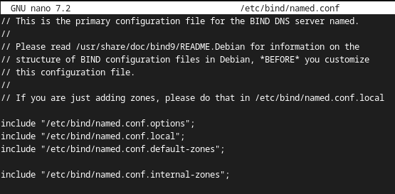
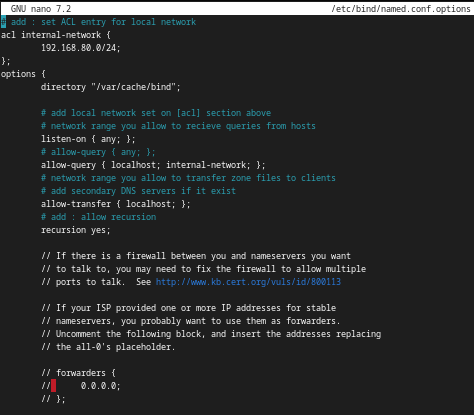
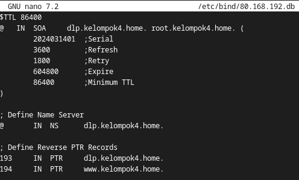
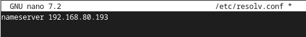

<div align="center">
  <h1 style="text-align: center;font-weight: bold">Laporan Praktikum
  <br>Workshop Administrasi Jaringan</h1>
  <h4 style="text-align: center;">Dosen Pengampu : Dr. Ferry Astika Saputra, S.T., M.Sc.</h4>
</div>
<br />
<div align="center">
  
  <h3 style="text-align: center;">Disusun Oleh : </h3>
  <p style="text-align: center;">
    <strong>Nama: Fauzan Abderrasheed</strong><br>
    <strong>NRP: 3123500020 </strong><br>
    <strong>Kelas: D3 IT A</strong>
  </p>
<h3 style="text-align: center;line-height: 1.5">Politeknik Elektronika Negeri Surabaya<br>Departemen Teknik Informatika Dan Komputer<br>Program Studi Teknik Informatika<br>2023/2024</h3>
  <hr><hr>
</div>

# Ekosistem Internet dan DNS Concept


### nsswitch

Pada Linux Debian (dan sistem berbasis Linux lainnya), file **`/etc/nsswitch.conf`** digunakan untuk mengonfigurasi **Name Service Switch (NSS)**, yang menentukan bagaimana sistem mencari informasi terkait layanan nama, seperti pencarian pengguna, grup, host, dan lainnya.


**Penjelasan Beberapa Layanan**

1. **`passwd`**, **`group`**, dan **`shadow`**
   - Digunakan untuk mencari informasi tentang pengguna dan grup.
   - `files` berarti sistem akan mencari di `/etc/passwd`, `/etc/group`, dan `/etc/shadow`.
2. **`hosts`**
   - Digunakan untuk mencari alamat IP dari nama host.
   - `files` berarti sistem akan mencari di `/etc/hosts` terlebih dahulu.
   - `dns` berarti sistem akan menggunakan DNS jika tidak menemukan hasil di `/etc/hosts`.
3. **`networks`**, **`protocols`**, **`services`**, **`ethers`**, **`rpc`**
   - Digunakan untuk mencari informasi tentang jaringan, protokol, layanan, dan lainnya.

### /etc/hosts


File **`/etc/hosts`** digunakan untuk **memetakan nama host ke alamat IP** tanpa harus menggunakan DNS (Domain Name System). Ini memungkinkan sistem untuk **menemukan alamat IP dari nama host secara lokal** sebelum mencoba menggunakan layanan eksternal seperti DNS.

Contoh:


Mengkonfigurasi alamat ip dalam `/etc/hosts` dengan nama ‘ale’, dengan ini komputer di atas dapat digunakan untuk ping komputer dengan alamat ip dari komputer ale


Untuk mencari alamat ip nya bisa menggunakan command `ip addr`


### resolv.conf

File **`/etc/resolv.conf`** digunakan oleh sistem Linux untuk **mengonfigurasi DNS (Domain Name System)**, yaitu layanan yang menerjemahkan nama domain menjadi alamat IP.

Untuk melihat manual dari file tersebut bisa menggunakan command `man resolv.conf`


Sehingga akan menampilkan manual book dari resolv.conf


Sedangkan isi dari file resolv.conf sendiri bisa dicek menggunakan command

```bash
sudo less /etc/resolv.conf
```


1. nameserver

   Direktif **`nameserver`** digunakan untuk menetapkan alamat IP server DNS yang akan digunakan untuk pencarian nama domain.

   - `<alamat_IP>` → Alamat IP dari server DNS (IPv4 atau IPv6).
   - Bisa ada lebih dari satu **`nameserver`**, dan sistem akan mencoba secara berurutan jika satu gagal.

2. search

   Direktif **`search`** digunakan untuk menentukan domain yang akan dicoba jika hanya sebagian nama host yang diberikan.

Jika kita mencoba ping www


Dari konfigurasi yang ada pada `/etc/resolv.conf`, ada dua hal yang mempengaruhi resolusi domain:

1. **`search pens.ac.id`**
   - Ini berarti ketika mencoba menjalankan **`ping www`**, sistem akan mencoba menambahkan domain `pens.ac.id` ke nama host yang tidak lengkap.
   - Sehingga, sistem akan mencoba **`ping www.pens.ac.id`** secara otomatis.
2. **`nameserver 202.9.85.4` dan `nameserver 202.9.85.3`**
   - Jika domain yang dihasilkan (`www.pens.ac.id`) tidak ditemukan dalam cache lokal (`/etc/hosts`), sistem akan meminta server DNS di **202.9.85.4** atau **202.9.85.3** untuk menerjemahkannya ke alamat IP.

### root.hints

File **`/usr/share/dns/root.hints`** adalah daftar server DNS **root** yang digunakan oleh sistem **resolver DNS rekursif** untuk menemukan server authoritative bagi domain tertentu. File ini sering digunakan oleh **server DNS lokal** (seperti **BIND, Unbound, atau PowerDNS**) untuk memulai pencarian domain yang tidak ada dalam cache atau zona lokal.


# Instalasi & Konfigurasi bind9

## Konfigurasi Jaringan Internal

### Instalasi BIND

Masuk root, dan gunakan command dibawah untuk menginstall bind9

```bash
root@dlp:~# apt -y install bind9 bind9utils
```

### Konfigurasi dan Penyesuaian BIND

Menambahkan file konfigurasi baru yaitu `named.conf.internal-zones` ke dalam file utama konfigurasi BIND `/etc/bind/named.conf`



### Konfigurasi akses kontrol dan kebijakan query pada BIND DNS Server



- **Menentukan ACL (Access Control List)**
  - Anda membuat ACL bernama `internal-network` untuk jaringan **192.168.80.0/24**.
  - ACL ini digunakan untuk menentukan siapa saja yang diizinkan mengakses layanan DNS.
- **Mengatur kebijakan query dan transfer zona**
  - `allow-query { localhost; internal-network; };` → Hanya mengizinkan **localhost** dan jaringan **internal** untuk melakukan query ke DNS server.
  - `allow-transfer { localhost; };` → Hanya mengizinkan **localhost** untuk melakukan transfer zona, biasanya untuk secondary DNS.
- **Mengaktifkan rekursi**
  - `recursion yes;` → Mengizinkan pencarian rekursif, yang berguna untuk melakukan resolusi nama domain selain zona yang dikelola sendiri.
- **Mengatur validasi DNSSEC dan konfigurasi IPv6**
  - `dnssec-validation auto;` → Mengaktifkan validasi DNSSEC secara otomatis.
  - `listen-on-v6 { any; };` → Konfigurasi agar BIND mendengarkan koneksi IPv6.

### Konfigurasi Zona DNS di BIND


- **Zona Forward (kelompok4.home)**
  - Zona ini digunakan untuk menerjemahkan **nama domain ke alamat IP**.
  - Disimpan dalam file **`/etc/bind/kelompok4.home.lan`**.
  - Bertindak sebagai **master** (utama), artinya server ini adalah sumber resmi data DNS untuk domain tersebut.
  - `allow-update { none; };` → Tidak mengizinkan update dinamis ke zona ini.
- **Zona Reverse (80.168.192.in-addr.arpa)**
  - Zona ini digunakan untuk **menerjemahkan alamat IP ke nama domain** (reverse lookup).
  - Disimpan dalam file **`/etc/bind/80.168.192.db`**.
  - Juga bertindak sebagai **master**, dengan **update dinamis dinonaktifkan**.

### **Konfigurasi opsi BIND untuk menggunakan hanya IPv4 dan menonaktifkan IPv6**.


**Mengedit file `/etc/default/named`**

- Menambahkan opsi `OPTIONS="-u bind -4"`, yang menginstruksikan BIND untuk hanya menggunakan **IPv4** dan mengabaikan **IPv6**.
- Ini berguna jika jaringan Anda hanya menggunakan IPv4 dan ingin menghindari log error terkait IPv6.

## Konfigurasi Zone Files

### **Pembuatan dan konfigurasi file zona forward lookup pada BIND DNS Server**.

Buat file zona yang memungkinkan server menerjemahkan nama domain menjadi alamat IP.
Konfigurasikan seperti di bawah ini menggunakan Jaringan internal [**192.168.80.0/24**.], Nama domain [kelompok4.home].


### **Pembuatan dan konfigurasi file zona reverse lookup pada BIND DNS Server**.

Buat file zona yang memungkinkan server menerjemahkan alamat IP menjadi nama domain.
Konfigurasikan seperti di bawah ini menggunakan Jaringan internal [**192.168.80.0/24**.], Nama domain [kelompok4.home].



## BIND: Verify Resolution

### Restart BIND untuk menerapkan perubahan

Masuk root dan gunakan command dibawah ini

```bash
root@dlp:~# systemctl restart named
```

### Konfigurasi DNS Client untuk menggunakan DNS Server sendiri



File **`/etc/resolv.conf`** digunakan oleh sistem Linux untuk menentukan **DNS server mana yang akan digunakan untuk melakukan query DNS** (resolving domain ke IP dan sebaliknya).

Dengan mengedit **`/etc/resolv.conf`** dan mengubah **nameserver** menjadi **10.0.0.30**, berarti:

✅ Mengatur sistem supaya pakai **DNS Server sendiri** (BIND di **10.0.0.30**)

✅ Prioritaskan pencarian DNS ke **server lokal dulu**, sebelum ke DNS eksternal

✅ Bikin sistem bisa resolve **domain lokal** yang cuma dikenali oleh DNS internal

### **DNS Query menggunakan DiG (Domain Information Groper)** untuk **Forward Lookup**.


Perintah di atas digunakan untuk **mengecek resolusi nama domain ke alamat IP (Forward DNS Lookup)** dengan memanfaatkan **DNS Server yang telah dikonfigurasi**.

### Reverse DNS Lookup


Perintah di atas digunakan untuk **melakukan pencarian balik (reverse lookup)** guna menemukan **nama domain yang terkait dengan alamat IP** tertentu.
