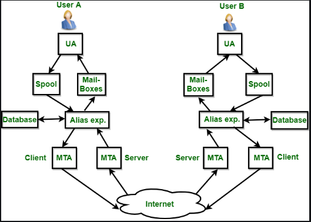

<div align="center">
  <h1 style="text-align: center;font-weight: bold">Laporan Praktikum
  <br>Workshop Administrasi Jaringan</h1>
  <h4 style="text-align: center;">Dosen Pengampu : Dr. Ferry Astika Saputra, S.T., M.Sc.</h4>
</div>
<br />
<div align="center">
  
  <h3 style="text-align: center;">Disusun Oleh : </h3>
  <p style="text-align: center;">
    <strong>Nama: Fauzan Abderrasheed</strong><br>
    <strong>NRP: 3123500020 </strong><br>
    <strong>Kelas: D3 IT A</strong>
  </p>
<h3 style="text-align: center;line-height: 1.5">Politeknik Elektronika Negeri Surabaya<br>Departemen Teknik Informatika Dan Komputer<br>Program Studi Teknik Informatika<br>2023/2024</h3>
  <hr><hr>
</div>

# Rangkuman Electronic Mail 
https://www.geeksforgeeks.org/introduction-to-electronic-mail/ 
## Rangkuman

Surel, atau surat elektronik, adalah metode utama untuk bertukar pesan melalui internet. Layanan ini memungkinkan pengguna internet mengirim pesan dalam bentuk surat (mail) dengan format tertentu, termasuk teks, gambar, audio, dan video, kepada pengguna lain di seluruh dunia. Sistem surel melibatkan komponen penting seperti Agen Pengguna (UA), Agen Transfer Pesan (MTA), Kotak Surat (Mailbox), dan Spool file, yang semuanya bekerja sama untuk memfasilitasi pengiriman dan penerimaan pesan. Meskipun surel menawarkan keuntungan signifikan seperti kecepatan, efektivitas biaya, dan kemampuan untuk mengirim lampiran, surel juga memiliki kelemahan, termasuk risiko spam, serangan _phishing_, kelebihan informasi, dan potensi miskomunikasi.

## Poin-Poin Utama

- Basics of email:
	- Alamat email: Ini adalah pengidentifikasi unik untuk setiap pengguna, biasanya dalam format name@domain.com.
	- Klien email: Ini adalah program perangkat lunak yang digunakan untuk mengirim, menerima, dan mengelola email, seperti Gmail, Outlook, atau Apple Mail.
	- Server email: Ini adalah sistem komputer yang bertanggung jawab untuk menyimpan dan meneruskan email ke penerima yang dituju.
- Surel (email) adalah metode pertukaran pesan melalui internet yang memungkinkan pengiriman berbagai jenis data.
- Surel (email) memiliki pengirim dan penerima, mirip dengan layanan pos tradisional.
- Komponen dasar sistem surel meliputi Agen Pengguna (UA) untuk mengirim dan menerima, Agen Transfer Pesan (MTA) untuk mentransfer, Mail Box untuk menyimpan pesan, dan Spool file untuk mengelola pesan keluar. Berikut adalah rangkuman poin-poin penting mengenai komponen dalam sistem email:
	- **User Agent (UA):** Aplikasi yang digunakan pengguna untuk membuat, mengirim, menerima, membalas email, serta mengelola kotak surat (mailbox). Sering disebut "mail reader".
	- **Message Transfer Agent (MTA):** Bertanggung jawab mentransfer email antar sistem. Membutuhkan MTA klien dan server. Menggunakan **Simple Mail Transfer Protocol (SMTP)** untuk pengiriman antar MTA.
		
	- **Mailbox:** File di hard drive lokal tempat email yang diterima disimpan. Hanya pemilik mailbox yang dapat mengaksesnya. Pemilik bisa membacanya atau menghapusnya sesuai keinginannya.
	- **Spool file:** File yang berisi email yang akan dikirim. UA menambahkan email keluar ke file ini, dan MTA mengambilnya untuk dikirim.
	- **Mailing list (Alias):** Satu nama yang mewakili beberapa alamat email. Ketika email dikirim ke alias, sistem akan membuat dan mengirim email terpisah untuk setiap alamat dalam daftar. Jika alias tidak terdaftar, email dikirim ke alamat tersebut.
- Proses pengiriman surel melibatkan penulisan pesan, memasukkan alamat penerima, subjek, isi, lampirkan file yang diperlukan jika ada dan mengirimkannya melalui peladen surel.
- Surel (email) dapat menggunakan fitur CC (carbon copy) dan BCC (blind carbon copy) untuk mengirim salinan pesan kepada beberapa penerima, serta opsi reply, reply all, dan forward email untuk mengelola percakapan.
- Surel (email) menyediakan layanan seperti komposisi (menulis pesan dan jawaban), transfer (mengirim), pelaporan (konfirmasi pengiriman), menampilkan (menyajikan pesan), dan disposisi (tindakan penerima terhadap pesan).
	- **Komposisi** : Proses untuk membuat pesan dan jawaban.
	- **Transfer** : prosedur pengiriman mail dari pengirim ke penerima.
	- **Pelaporan (Reporting)** : Konfirmasi untuk pengiriman surat, membantu pengguna memeriksa apakah email mereka sudah terkirim, hilang atau ditolak.
	- **Disposisi (Disposition)** : Hal ini berhubungan dengan apa yang akan dilakukan oleh penerima setelah menerima email, yaitu menyimpan email, menghapus sebelum atau sesudah membaca.
- Daftar surel, atau alias, memungkinkan satu nama mewakili beberapa alamat surel, memfasilitasi pengiriman pesan ke banyak penerima sekaligus.
- Keuntungan surel meliputi komunikasi yang cepat dan nyaman, kemampuan penyimpanan dan pencarian pesan yang mudah, pengiriman lampiran, efektivitas biaya, dan ketersediaan 24/7.
- Kelemahan surel mencakup risiko spam dan serangan _phishing_, kelebihan informasi, kurangnya komunikasi tatap muka, potensi miskomunikasi, dan masalah teknis.

# Laporan Mail Server

## Postfix Configuration

Konfigurasi SMTP-Auth untuk menggunakan Davecot SASL Function

1. Instalasi Postfix:
	```bash
	apt -y install postfix sasl2-bin
	```
2. 