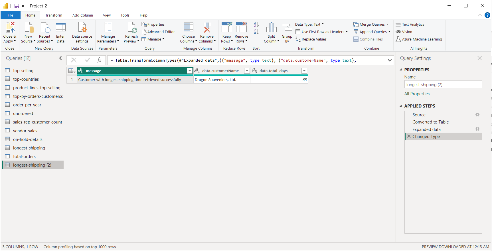
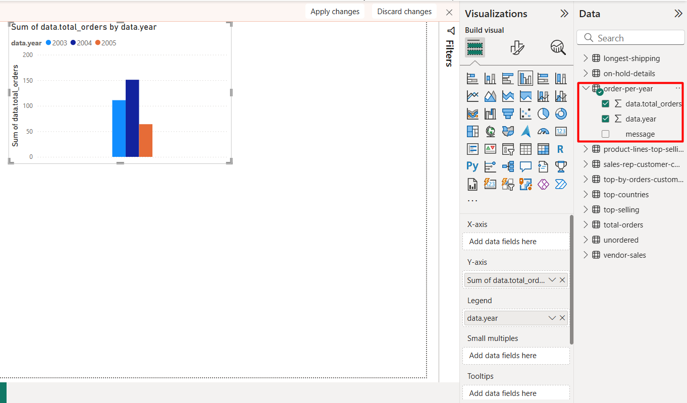
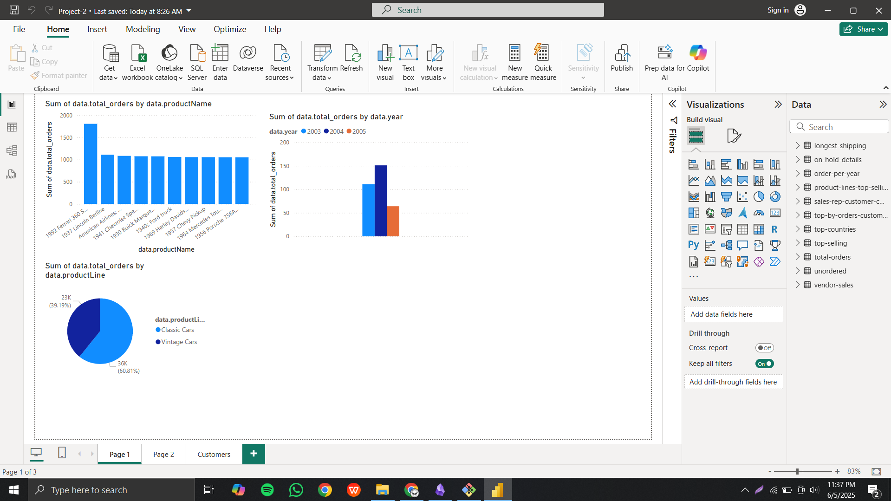

<div align="center">
  <h1 style="text-align: center;font-weight: bold">Laporan Praktikum
  <br>Workshop Administrasi Jaringan</h1>
  <h4 style="text-align: center;">Dosen Pengampu : Dr. Ferry Astika Saputra, S.T., M.Sc.</h4>
</div>
<br />
<div align="center">
  
  <h3 style="text-align: center;">Disusun Oleh : </h3>
  <p style="text-align: center;">
    <strong>Nama: Fauzan Abderrasheed</strong><br>
    <strong>NRP: 3123500020 </strong><br>
    <strong>Kelas: D3 IT A</strong>
  </p>
<h3 style="text-align: center;line-height: 1.5">Politeknik Elektronika Negeri Surabaya<br>Departemen Teknik Informatika Dan Komputer<br>Program Studi Teknik Informatika<br>2023/2024</h3>
  <hr><hr>
</div>


## Langkah-Langkah Set Up Docker & Laravel

Ikuti langkah-langkah di bawah ini untuk menjalankan proyek di mesin lokal Anda:

1.  **Clone Repositori:**

    ```bash
    git clone [https://github.com/wangsa19/axon_docker.git](https://github.com/wangsa19/axon_docker.git)
    cd axon_docker
    ```

    _(Ganti URL dengan repositori yang benar.)_

2.  **Buat File Konfigurasi Lingkungan (`.env`):**

    - **Buat `./.env.db`** (di _root_ proyek) dengan konten dasar:
      ```
      MYSQL_DATABASE=laravel_db
      MYSQL_USER=laravel_user
      MYSQL_PASSWORD=secret
      MYSQL_ROOT_PASSWORD=verysecret
      ```
    - **Salin `./src/.env.example` ke `./src/.env`:**
      ```bash
      cp src/.env.example src/.env
      ```
      Kemudian, edit `src/.env` dan sesuaikan bagian database:
      ```ini
      DB_HOST=db
      DB_PORT=3306
      DB_DATABASE=laravel_db
      DB_USERNAME=laravel_user
      DB_PASSWORD=secret
      ```

3.  **Bangun dan Jalankan Kontainer Docker:**

    ```bash
    docker-compose up -d --build
    ```

4.  **Instal Dependensi Composer:**

    ```bash
    docker-compose exec app composer install
    ```

5.  **Generate Laravel App Key:**

    ```bash
    docker-compose exec app php artisan key:generate
    ```

6.  **Jalankan Migrasi Database:**
    ```bash
    docker-compose exec app php artisan migrate
    ```

## Akses Aplikasi dan Database

- **Aplikasi Laravel:** Buka browser Anda dan kunjungi [http://localhost:8000](http://localhost:8000).
- **phpMyAdmin:** Buka browser Anda dan kunjungi [http://localhost:8080](http://localhost:8080).
  - **Username:** `root`
  - **Password:** Gunakan `MYSQL_ROOT_PASSWORD` dari `.env.db` Anda (default: `verysecret`).

## Perintah Umum

- **Start/Stop Kontainer:**
  ```bash
  docker-compose up -d    # Start di background
  docker-compose stop     # Stop semua kontainer
  docker-compose down     # Stop dan hapus kontainer (data volume tetap)
  docker-compose down -v  # Stop dan hapus kontainer + data volume (HATI-HATI!)
  ```
- **Masuk ke Kontainer Aplikasi:**
  ```bash
  docker-compose exec app sh
  ```

---

## API Endpoints

Berikut adalah daftar endpoint API yang tersedia beserta deskripsi dan contoh penggunaannya. Semua endpoint ini dapat diakses melalui `http://localhost:8000/api/`.

### 1. Produk Terlaris (Top 10 Products by Total Orders)

Mengambil daftar 10 produk teratas berdasarkan total kuantitas pesanan.

- **URL:** `/products/top-selling`
- **Metode:** `GET`
- **Controller:** `Api\ProductController`
- **Fungsi:** `getTopSellingProducts`
- **Contoh Respons:**
  ```json
  {
    "message": "Top 10 selling products retrieved successfully",
    "data": [
      {
        "productName": "1992 Ferrari 360 Spider red",
        "total_orders": "1808"
      }
      // ... 9 produk lainnya
    ]
  }
  ```

### 2. Negara Pelanggan Teratas (Top 5 Countries by Total Customers)

Mengambil daftar 5 negara dengan jumlah pelanggan terbanyak.

- **URL:** `/customers/top-countries`
- **Metode:** `GET`
- **Controller:** `Api\CustomerController`
- **Fungsi:** `getTopCustomerCountries`
- **Contoh Respons:**
  ```json
  {
    "message": "Top 5 customer countries retrieved successfully",
    "data": [
      {
        "country": "USA",
        "total_customers": 36
      }
      // ... 4 negara lainnya
    ]
  }
  ```

### 3. Lini Produk Terlaris (Top 2 Product Lines by Total Quantity Ordered)

Mengambil daftar 2 lini produk teratas berdasarkan total kuantitas produk yang dipesan dari lini tersebut.

- **URL:** `/product-lines/top-selling`
- **Metode:** `GET`
- **Controller:** `Api\ProductLineController`
- **Fungsi:** `getTopSellingProductLines`
- **Contoh Respons:**
  ```json
  {
    "message": "Top 2 selling product lines retrieved successfully",
    "data": [
      {
        "productLine": "Classic Cars",
        "total_orders": 18274
      },
      {
        "productLine": "Vintage Cars",
        "total_orders": 12797
      }
    ]
  }
  ```

### 4. Pelanggan Teratas Berdasarkan Pesanan (Top 5 Customers by Total Orders)

Mengambil daftar 5 pelanggan teratas berdasarkan total jumlah pesanan yang mereka lakukan.

- **URL:** `/customers/top-by-orders`
- **Metode:** `GET`
- **Controller:** `Api\CustomerController`
- **Fungsi:** `getTopCustomersByOrders`
- **Contoh Respons:**
  ```json
  {
    "message": "Top 5 customers by total orders retrieved successfully",
    "data": [
      {
        "customerName": "Euro+ Shopping Channel",
        "total_orders": 26
      }
      // ... 4 pelanggan lainnya
    ]
  }
  ```

### 5. Total Pesanan per Tahun (Total Orders Per Year)

Mengambil total jumlah pesanan yang dilakukan untuk setiap tahun.

- **URL:** `/orders/per-year`
- **Metode:** `GET`
- **Controller:** `Api\OrderController`
- **Fungsi:** `getOrdersPerYear`
- **Contoh Respons:**
  ```json
  {
    "message": "Total orders per year retrieved successfully",
    "data": [
      {
        "year": 2003,
        "total_orders": 111
      },
      {
        "year": 2004,
        "total_orders": 151
      },
      {
        "year": 2005,
        "total_orders": 64
      }
    ]
  }
  ```

### 6. Produk yang Belum Dipasang (Unordered Products)

Mengambil daftar produk yang belum pernah tercatat dalam detail pesanan (belum pernah dipesan).

- **URL:** `/products/unordered`
- **Metode:** `GET`
- **Controller:** `Api\ProductController`
- **Fungsi:** `getUnorderedProducts`
- **Contoh Respons:**
  ```json
  {
    "message": "Products that have not been ordered retrieved successfully",
    "data": [
      {
        "productName": "1985 Toyota Supra"
      }
    ]
  }
  ```

### 7. Perwakilan Penjualan dan Jumlah Pelanggan (Sales Representatives with Customer Count)

Mengambil daftar perwakilan penjualan dan jumlah total pelanggan yang mereka layani, diurutkan dari yang memiliki pelanggan terbanyak.

- **URL:** `/employees/sales-rep-customer-count`
- **Metode:** `GET`
- **Controller:** `Api\EmployeeController`
- **Fungsi:** `getSalesRepresentativesWithCustomerCount`
- **Contoh Respons:**
  ```json
  {
    "message": "Sales representatives with customer count retrieved successfully",
    "data": [
      {
        "employeeNumber": 1401,
        "representativename": "Pamela Castillo",
        "total_customers": 10
      },
      {
        "employeeNumber": 1504,
        "representativename": "Barry Jones",
        "total_customers": 9
      },
      {
        "employeeNumber": 1323,
        "representativename": "George Vanauf",
        "total_customers": 8
      }
      // ... daftar perwakilan penjualan lainnya
    ]
  }
  ```

### 8. Ringkasan Penjualan Vendor (Aggregated Sales Data per Product Vendor)

Mengambil ringkasan data penjualan yang diagregasi per vendor produk, termasuk jumlah produk unik, total kuantitas yang dipesan, dan total harga penjualan.

- **URL:** `/reports/vendor-sales`
- **Metode:** `GET`
- **Controller:** `Api\VendorReportController`
- **Fungsi:** `getVendorSalesSummary`
- **Contoh Respons:**
  ```json
  {
    "message": "Vendor sales summary retrieved successfully",
    "data": [
      {
        "productVendor": "Classic Metal Creations",
        "total_products": 10,
        "total_quantity": "9678",
        "total_price": "934554.42"
      },
      {
        "productVendor": "Carousel DieCast Legends",
        "total_products": 9,
        "total_quantity": "8735",
        "total_price": "667190.00"
      },
      {
        "productVendor": "Exoto Designs",
        "total_products": 9,
        "total_quantity": "8604",
        "total_price": "793392.31"
      }
      // ... daftar vendor lainnya
    ]
  }
  ```
  ### 9. Detail Pesanan "On Hold" (On-Hold Order Details)

Mengambil detail pesanan yang saat ini berstatus "On Hold", termasuk informasi pelanggan, nomor pesanan, jumlah total produk, dan total harga.

- **URL:** `/orders/on-hold-details`
- **Metode:** `GET`
- **Controller:** `Api\OrderController`
- **Fungsi:** `getOnHoldOrderDetails`
- **Contoh Respons:**
  ```json
  {
    "message": "On-hold order details retrieved successfully",
    "data": [
      {
        "customerNumber": 144,
        "customerName": "Volvo Model Replicas, Co",
        "orderNumber": 10334,
        "Total_products": 12,
        "Total_Price": "46028.34",
        "status": "On Hold"
      },
      {
        "customerNumber": 328,
        "customerName": "Tekni Collectables Inc.",
        "orderNumber": 10401,
        "Total_products": 24,
        "Total_Price": "87050.08",
        "status": "On Hold"
      },
      {
        "customerNumber": 450,
        "customerName": "The Sharp Gifts Warehouse",
        "orderNumber": 10407,
        "Total_products": 12,
        "Total_Price": "52229.55",
        "status": "On Hold"
      }
      // lainnya
    ]
  }
  ```

### 10. Pelanggan dengan Waktu Pengiriman Terlama (Customer with Longest Shipping Time)

Mengambil informasi pelanggan yang memiliki waktu pengiriman (selisih antara `shippedDate` dan `orderDate`) terlama untuk salah satu pesanannya.

- **URL:** `/customers/longest-shipping`
- **Metode:** `GET`
- **Controller:** `Api\CustomerController`
- **Fungsi:** `getCustomerWithLongestShippingTime`
- **Contoh Respons:**
  ```json
  {
    "message": "Customer with longest shipping time retrieved successfully",
    "data": {
      "customerName": "Australian Collectors, Co.",
      "total_days": 66
    }
  }
  ```

### 11. Total Pesanan Vendor (Vendor Names and Their Total Orders)

Mengambil daftar nama vendor dan jumlah total pesanan yang terkait dengan produk mereka, diurutkan berdasarkan total pesanan terbanyak.

- **URL:** `/vendors/total-orders`
- **Metode:** `GET`
- **Controller:** `Api\VendorReportController`
- **Fungsi:** `getVendorTotalOrders`
- **Contoh Respons:**
  ```json
  {
    "message": "Vendor total orders retrieved successfully",
    "data": [
      {
        "vendername": "Classic Metal Creations",
        "total_orders": 270
      },
      {
        "vendername": "Motor City Art Classics",
        "total_orders": 249
      },
      {
        "vendername": "Carousel DieCast Legends",
        "total_orders": 246
      }
      // ... daftar vendor lainnya
    ]
  }
  ````


## Menghubungkan API dengan Power BI 

### Import Data

Langkah pertama yang perlu dilakukan untuk menampilkan data menggunakan tampilan power BI adalah meng-import data dari URL Endpoint yang sudah disetup menggunakan Docker. 
Contoh:

```bash
http://localhost:8000/api/customers/longest-shipping
```

Gunakan _Get Data_ dan pilih opsi _Web_ untuk import data menggunakan URL Endpoint seperti di atas.




### Pilih Visualisasi

Langkah kedua adalah memilih opsi visualisasi yang diperlukan, seperti chart, tabel dan sebagainya.


### Pilih Data Visualisasi

Langkah ketiga adalah memilih data yang akan divisualisasikan, dengan mencentang kolom data yang sudah di-import sebelumnya.



### Tampilan Data

Jika sudah, maka data akan tertampilkan seperti ini


